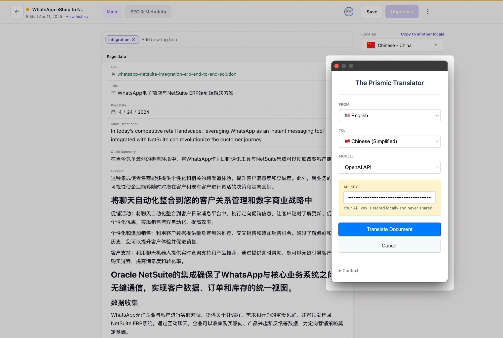
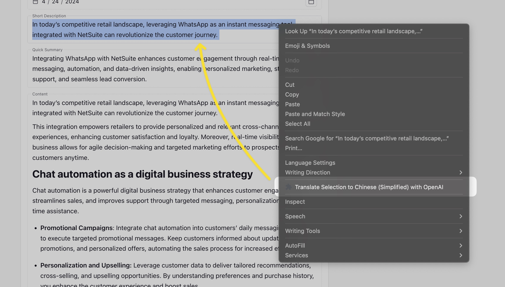
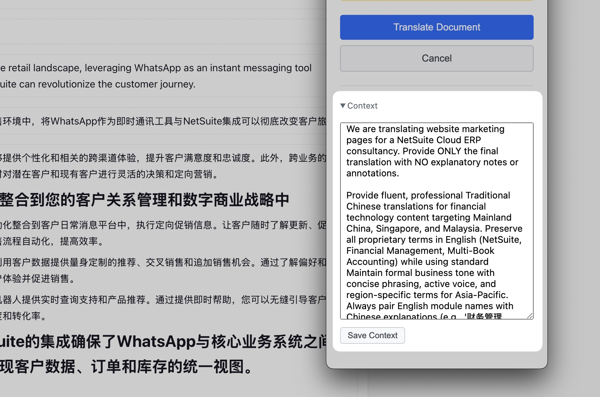

# Prismic Document Translator

A Chrome extension that allows you to translate Prismic document fields directly in the browser with a single click.

## Features

- **One-click translation** of all Prismic fields: text, rich text, alt text, titles, and more
- **Multiple translation services**: OpenAI API, DeepSeek API (UI only shows these now)
- **Per-service API key management**: API keys are stored per service and never shared
- **Customizable translation context**: Add custom instructions/context in the popup
- **HTML and formatting preservation**: All tags (<strong>, <em>, <a>, etc.) and links are preserved
- **i18n prefix replacement**: All URLs and text fields update i18n prefixes (e.g., /en-us/ → /zh-hk/)
- **Context menu translation**: Right-click selected text to translate (preserves HTML, links, formatting)
- **Skips technical/ID fields**: UID, YouTube, slug, guid, etc. are never translated
- **Skips fields labeled exactly 'name'**
- **Skips empty, numeric, email, and code-like fields**
- **Detects and translates image alt text**: Including in repeating groups and with accessibility placeholders
- **Lazy-loads all fields**: Scrolls slowly to ensure all fields are detected
- **Progress bar and per-field status**: Real-time feedback in the popup
- **Cancel button**: Abort translation at any time
- **Flags in language dropdowns**: For both source and target languages
- **Keyboard shortcut**: Ctrl+Shift+X (Windows/Linux) or Cmd+Shift+X (Mac) to open the popup
- **Focus on Translate button**: Hit Enter to start translation immediately
- **API key box always visible**: No need to toggle model to see it
- **Storage migration and robust handling of legacy values**
- **Minimal permissions, privacy, and local-only API key storage**
- ...and more (see code for full details)

## Screenshots

<p align="center">
  
</p>
<p align="center" style="margin-bottom: 1em;"><em>Prismic Translator popup</em></p>

<p align="center">
  
</p>
<p align="center" style="margin-bottom: 1em;"><em>Context menu translation</em></p>

<p align="center">
  
</p>
<p align="center" style="margin-bottom: 1em;"><em>Provide your own context</em></p>

## Installation

### From Source (Development)

1. Clone or download this repository
2. Open Chrome and navigate to `chrome://extensions/`
3. Enable "Developer mode" in the top right corner
4. Click "Load unpacked" and select the extension directory
5. The extension icon should appear in your Chrome toolbar

## Usage

1. **Navigate to a Prismic document** in your browser
2. **Click the extension icon** in the Chrome toolbar
3. **Configure your settings**:
   - Select source language (or use auto-detect)
   - Select target language
   - Choose translation service
   - Enter API key if using DeepL or Azure (optional for Google)
4. **Preview (optional)**: Click "Preview Changes" to see which fields will be translated
5. **Translate**: Click "Translate Document" to translate all fields

## Supported Models

### OpenAI

- Uses OpenAI's GPT models for high-quality translation
- Requires an OpenAI API key
- Supports a wide range of languages and advanced translation features
- Sign up and get your API key at: https://platform.openai.com/

### DeepSeek

- Uses DeepSeek's translation models for fast and accurate results
- Requires a DeepSeek API key
- Supports multiple languages
- Sign up and get your API key at: https://platform.deepseek.com/

## Supported Field Types

The extension automatically detects and translates:

- **Text fields** - Simple text inputs and textareas
- **Title fields** - Document titles and headings (rich text)
- **Rich text fields** - TipTap/ProseMirror formatted content with **preserved formatting**
- **Alt text fields** - Image alternative text descriptions (including in groups)
- **Description fields** - Multi-line content descriptions

### Smart Field Detection

The extension intelligently **skips** fields that shouldn't be translated:

- UID fields and unique identifiers
- URLs and link fields
- YouTube IDs and media references
- Email addresses
- Numeric fields
- Tag fields
- Very short content (< 3 characters)
- Code-like content and IDs
- Fields labeled exactly 'name'

**Note:** If a rich text field contains inline images or video embeds, it will be skipped during full document translation. These introduce a bit of complexity and I couldn't be bothered to figure it out. To translate these fields, use the context menu translation (right-click the field and select "Translate Selected").

## Settings

### Language Options

- **Auto-detect source language** or specify manually
- **Target language selection** from 10+ supported languages
- **Translation service** selection with API key management

### Advanced Options

- **Translate rich text fields** - Include formatted text content
- **Translate title fields** - Include document titles and headings
- **Translate image alt text** - Include image descriptions
- **Preserve formatting** - Maintain text formatting when possible

## Privacy & Security

- **API keys are stored locally** in your browser and never shared
- **No data is sent to our servers** - all translation happens directly with your chosen service
- **Open source code** - you can review exactly what the extension does
- **Minimal permissions** - only accesses Prismic pages when needed

## Troubleshooting

### Extension not working on Prismic page

- Make sure you're on a Prismic document editing page
- Try refreshing the page and clicking the extension icon again
- Check the browser console for any error messages

### Translation not working

- Verify your API key is correct (for DeepL/Azure)
- Check your internet connection
- Ensure you haven't exceeded your API quota
- Try switching to a different translation service

### Fields not being detected

- The extension uses smart selectors to find Prismic fields
- Some custom Prismic setups might not be detected
- Try the "Preview" mode to see which fields are found
- Report issues with specific field types on GitHub

## Development

### Project Structure

```
translator/
├── manifest.json          # Extension manifest
├── popup.html            # Extension popup interface
├── popup.css             # Popup styling
├── popup.js              # Popup logic
├── content.js            # Content script for Prismic pages
├── background.js         # Background service worker
├── icons/                # Extension icons
├── screenshots/          # Screenshots for README and documentation
├── install.md            # Quick installation guide
└── README.md            # This file
```

### Building from Source

1. Clone the repository
2. No build process required - it's vanilla JavaScript
3. Load the extension in Chrome developer mode
4. Test on Prismic documents for development

### Testing

Use browser developer tools to debug field selection
Check console logs for translation progress

### Contributing

1. Fork the repository
2. Create a feature branch
3. Make your changes
4. Test thoroughly with different Prismic document types
5. Submit a pull request

## Changelog

### Version 1.0.0

- Initial release
- Support for Google Translate, DeepL, and Azure Translator
- Smart Prismic field detection
- Preview mode
- Settings persistence
- Visual feedback with field highlighting

## License

MIT License - see LICENSE file for details

## Support

- **GitHub Issues**: Report bugs and request features
- **Documentation**: Check this README for common issues

## Disclaimer

This extension is NOT officially affiliated with Prismic. It's a third-party tool designed to enhance the Prismic editing experience.
